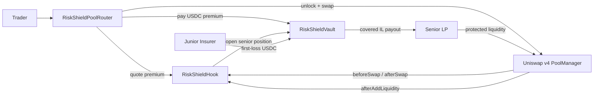

# RiskShield - Tranche-Based IL Insurance Hook

RiskShield makes Uniswap v4 LPing insurable by splitting liquidity into senior protected LP capital and junior first-loss insurance capital.

RiskShield turns impermanent loss into a priced, transferable risk market inside a Uniswap v4 pool. Senior LPs get protected liquidity. Junior insurers earn premium yield. Traders fund the reserve through hook-aware dynamic premiums.

Project ID: `HK-UHI9-0946`

UHI9 Theme: Impermanent Loss and Yield Systems

## Problem

Passive LPs still underwrite impermanent loss and loss-versus-rebalancing without a clear way to price or transfer that risk. This keeps conservative capital out of volatile Uniswap pools and makes LP yield hard to forecast.

## Solution

RiskShield introduces an insurance layer around a Uniswap v4 pool:

- Senior LPs provide protected liquidity and receive lower-risk yield.
- Junior insurers provide first-loss reserve capital, receive pool-specific shares, and earn premium yield.
- Traders pay a dynamic impermanent-loss protection premium when swaps are larger or more volatile.
- Premiums build the insurance reserve.
- When senior LPs exit, the vault compares their LP exit value against a hold benchmark and pays covered loss from the reserve.
- Pool risk limits prevent senior protection from overcommitting the junior reserve.

The MVP keeps the mechanism self-contained. It avoids perps, lending, options, and external oracle dependencies so the hook is easy to reason about and demo.

## Why This Is Novel

RiskShield is not just a dynamic fee hook, an IL calculator, or a standalone insurance vault. The core idea is tranche-based LP risk separation attached to real Uniswap v4 pool lifecycle events:

- Vanilla LPs sit in one blended risk class and absorb IL silently.
- Senior LPs enter protected liquidity and receive capped IL coverage on exit.
- Junior insurers provide first-loss USDC capital and earn premium yield.
- Traders pay small risk-priced premiums during volatile or larger swaps.
- The hook prices risk during swaps and records LP protection during liquidity lifecycle callbacks.

## Why Uniswap v4 Hooks

Uniswap v4 hooks can run around pool lifecycle events. RiskShield uses this to:

- Observe liquidity additions and removals.
- Signal higher LP fees before risky swaps.
- Account for swap premium accrual after swaps.
- Keep pool-specific senior/junior insurance accounting without forking Uniswap.

The hook deliberately avoids return-delta swap logic in the MVP. The current v4 router funds the insurance reserve alongside a real PoolManager swap; the production extension can add custom accounting for direct PoolManager fee custody after the core mechanism is tested.

The upgraded router now quotes the premium from the hook, pulls the calculated USDC premium from the trader, and funds the vault through an approved-router path. See `PERIPHERY.md` for the routing model and Universal Router / Permit2 production path.

## Architecture

```text
Trader swap
   |
   v
RiskShieldPoolRouter.swapAndPayPremium
   - quotes the RiskShield premium
   - pulls the trader-paid USDC premium
   - funds the RiskShield reserve path
   - unlocks PoolManager
   |
   v
RiskShieldHook.beforeSwap
   - calculates dynamic premium fee
   - returns v4 dynamic fee override
   |
   v
Uniswap v4 PoolManager.swap
   |
   v
RiskShieldHook.afterSwap
   - records premium analytics for the pool
   |
   v
RiskShieldVault
   - junior capital reserve
   - premium reserve
   - senior position accounting
   - covered IL settlement
```



## Contracts

- `RiskShieldHook.sol`: Uniswap v4 hook callback surface and premium fee calculation.
- `RiskShieldVault.sol`: Senior positions, junior reserves, premium accounting, and IL compensation.
- `RiskShieldPoolRouter.sol`: Demo router for real PoolManager initialize, liquidity, swap, premium quoting, and trader-paid premium flows.
- `HookDeployer.sol`: Minimal CREATE2 deployer used to mine the hook permission address.
- `InsuranceMath.sol`: Pure premium, value, and coverage math.
- `MockUSDC.sol`: 6-decimal local reserve token.
- `MockRiskAsset.sol`: 18-decimal local volatile token.

## MVP Flow

1. Alice opens a senior LP accounting position through v4 liquidity addition hook data.
2. Bob deposits USDC as junior first-loss reserve capital.
3. Traders swap through the v4 pool.
4. The hook raises fees for larger or more volatile swaps.
5. The router pulls the quoted USDC premium from the trader and credits RiskShield's reserve.
6. Alice exits after an adverse price move.
7. RiskShield pays covered IL from the available reserve, capped by coverage limits and actual reserve balance.

## Final Upgrade Features

- Approved-router premium funding so only hook-aware periphery can write premium reserve state.
- Pool risk controls for max coverage, reserve utilization, max exposure, min reserve, and max premium.
- Junior reserve shares, share price, withdrawal previews, and locked reserve logic.
- Active senior liability tracking to prevent undercollateralized protected LP positions.
- Explicit trader-paid premium path through `swapAndPayPremium`.

## Unichain Sepolia

Primary demo chain: Unichain Sepolia

- Chain ID: `1301`
- RPC: `https://sepolia.unichain.org`
- PoolManager: `0x00b036b58a818b1bc34d502d3fe730db729e62ac`
- PositionManager: `0xf969aee60879c54baaed9f3ed26147db216fd664`
- StateView: `0xc199f1072a74d4e905aba1a84d9a45e2546b6222`
- PoolSwapTest: `0x9140a78c1a137c7ff1c151ec8231272af78a99a4`
- PoolModifyLiquidityTest: `0x5fa728c0a5cfd51bee4b060773f50554c0c8a7ab`
- Permit2: `0x000000000022D473030F116dDEE9F6B43aC78BA3`

## Current Real-USDC v4 Deployment

```text
USDC: 0x31d0220469e10c4E71834a79b1f276d740d3768F
MockRiskAsset: 0x0ca086118b4d1ff6599b75d9f14defbc3242ab78
RiskShieldVault: 0xe12b741707eb4b9a8762d58c2e36b909e345d5e4
RiskShieldHook: 0x49026475bca9C0FDD778dDF143E7a596b4D6C7C0
RiskShieldPoolRouter: 0xb4c8d25afac20572347977e9dc1d18c61d58c736
Pool ID: 0xb0dda0a853ae4eefb5ed690dc7de5cfefe01ef3572152e0170db69c3e57f71c4
```

The hook address has the required `0x07c0` permission mask and the pool has been initialized on Unichain Sepolia. The latest CLI smoke test proves junior USDC reserve funding, protected senior liquidity, and trader-paid premium funding through `swapAndPayPremium`.

Latest smoke proof:

```text
Add protected senior liquidity: https://sepolia.uniscan.xyz/tx/0x509383492f853e6e12213712f3ee677e8ab2449deeb182e55e87548c8c517b4d
Swap and pay quoted premium: https://sepolia.uniscan.xyz/tx/0xe49dc0e0b373a2ef507d25a4e1b35d0d2be19cab7b70459322b590a45ab0ffab
Reserve available after smoke: 2.017 USDC
Junior share price after smoke: 1.0085
Active protected liability: 0.6 USDC
Senior positions opened: 1
Last premium: 17 bps
Pool tick after smoke: -30
Active pool liquidity: 10000000000
```

## What Judges Should Verify

- Hook address has permission bits `0x07c0`.
- Pool is initialized through the real Unichain Sepolia PoolManager.
- Senior protected liquidity was opened through `PoolManager.modifyLiquidity`.
- A v4 swap executed through the hook-aware `RiskShieldPoolRouter`.
- Trader-paid USDC premium was credited into the vault reserve.
- Junior share price increased after premium accrual.
- Active protected liability is tracked and locks reserve capacity.
- The frontend reads live Unichain Sepolia metrics and links to Uniscan proofs.

## Security Model

- Hook callbacks are gated by `msg.sender == PoolManager`.
- Router allowlisting protects premium funding because v4 hook `sender` represents router context, not the end user.
- `beforeSwapReturnDelta` is disabled to avoid the dangerous custom-delta swap path.
- Senior protection is blocked when reserve capacity is insufficient.
- Coverage is capped by reserve balance, max coverage bps, and active position liability.
- Junior withdrawal is blocked when reserve is backing active senior coverage.
- The hook-aware router quotes the premium before execution and pulls only the calculated USDC premium from the trader.

## Known Limitations and Production Extensions

- The current demo uses real Circle testnet USDC as reserve capital, but it is not production insurance.
- `mRISK` is a controlled demo risk asset so the hookathon flow is deterministic.
- RiskShield uses a custom hook-aware periphery router today; native Universal Router / Permit2 command integration is a production extension.
- The MVP keeps exit pricing deterministic and does not use a production oracle yet.
- Direct PoolManager fee redirection into the reserve is future hardening; the current proof funds the reserve through the approved router path alongside the swap.

## Local Setup

This repository expects Foundry.

```bash
forge test -vv
forge test --gas-report
npm run compile
npm run build
```

Create a local `.env` before deploying:

```bash
cp .env.example .env
```

Then fill:

- `PRIVATE_KEY`
- `UNICHAIN_SEPOLIA_RPC_URL`
- `ETHERSCAN_API_KEY`

The repo imports `v4-core` from the sibling folder cloned in this workspace:

```text
../v4-core
```

If you clone this repo elsewhere, install v4-core or update `remappings.txt`.

## Deployment

Deploy the full v4 integration:

```bash
forge script script/DeployV4RiskShield.s.sol:DeployV4RiskShield --rpc-url unichain_sepolia --broadcast
```

Run the real testnet smoke flow after deployment:

```bash
forge script script/SmokeV4RiskShield.s.sol:SmokeV4RiskShield --rpc-url unichain_sepolia --broadcast
```

The smoke flow mints the demo risk asset, approves the hook-aware router, adds protected liquidity through `PoolManager.modifyLiquidity`, swaps through `PoolManager.swap`, and pulls a quoted real-USDC insurance premium from the trader into the RiskShield reserve.

The earlier standalone vault/hook logic deployment script is also available:

```bash
forge script script/DeployRiskShield.s.sol:DeployRiskShield --rpc-url unichain_sepolia --broadcast
```

See `DEPLOYMENTS.md` for the address log, transaction hashes, and smoke readbacks.

## Frontend

The Progress Update 2 frontend is a local demo surface for RiskShield's insurance accounting path.

```bash
npm run dev
```

Open `http://127.0.0.1:5173`.

The frontend can connect a wallet, show deployed addresses, calculate senior LP coverage previews, and interact with deployed mock USDC / vault addresses.

## Progress Updates

Progress Update 1:

- Repo created.
- README and architecture documented.
- Contract skeletons added.
- Initial tests added for math, reserves, and senior coverage.

Progress Update 2:

- Core tests passing.
- Full v4 deployment script ready and used on Unichain Sepolia.
- Hook address mined with correct v4 permission bits.
- Pool initialized through Unichain Sepolia PoolManager.
- Real v4 liquidity and swap smoke flow passed.

Final submission target:

- GitHub repo.
- 2-4 minute demo video.
- Tests and/or frontend.
- Polished Unichain Sepolia demo.
